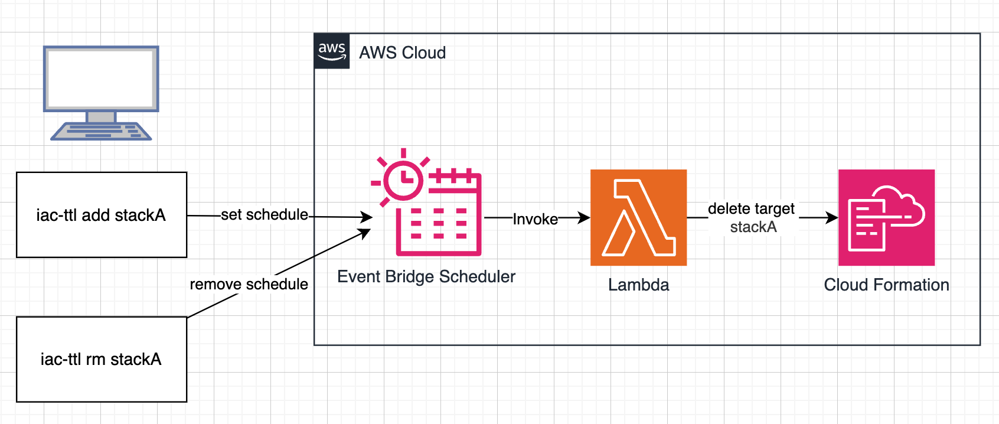

# IaC-TTL

A CLI tool to manage TTL (Time To Live) for CloudFormation stacks using AWS EventBridge Scheduler.

## Quick Start

### Installation

```bash
# Clone and build
git clone https://github.com/Taichi-iskw/IaC-TTL.git
cd IaC-TTL

# Deploy required AWS resources (Lambda, IAM roles)
make cdk-deploy
# Build and install the CLI tool to ~/bin
make install
```

### Basic Commands

#### Schedule a stack for deletion

```bash
# Schedule deletion after 24 hours
iac-ttl add my-stack -H 24

# Schedule deletion after 30 minutes
make deploy
iac-ttl add my-stack -m 30

# Schedule deletion after 1 hour and 30 minutes
iac-ttl add my-stack -H 1 -m 30
```

#### List scheduled deletions

```bash
iac-ttl ls
```

#### Remove a scheduled deletion

```bash
iac-ttl rm my-stack
```

## AWS Architecture



## Features

- Schedule CloudFormation stacks for automatic deletion after a specified time period
- List all scheduled stack deletions
- Remove scheduled deletions

## Development Commands

### CLI Development

```bash
# Build the CLI
make build

# Run tests
make test

# Clean build artifacts
make clean
```

### CDK Infrastructure

```bash
# Install CDK dependencies
make install-cdk

# Deploy the infrastructure
make cdk-deploy

# Destroy the infrastructure
make destroy
```

## Requirements

- AWS Account with appropriate permissions
- AWS CLI configured with credentials
- Go 1.21 or later
- Node.js and npm (for CDK)

## License

This project is licensed under the MIT License - see the LICENSE file for details.
